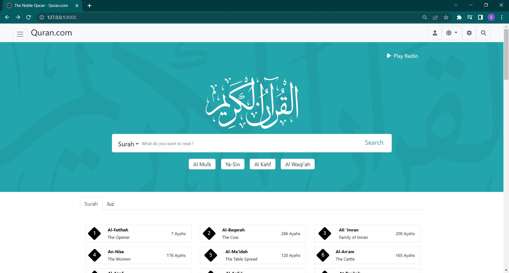
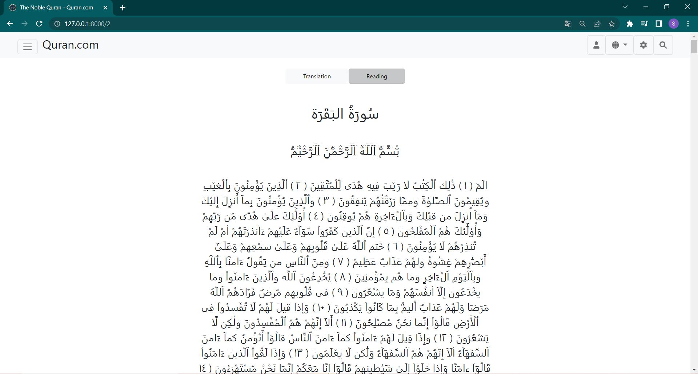
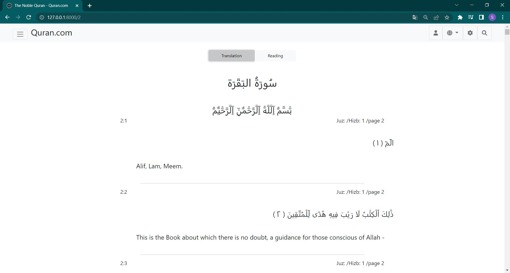
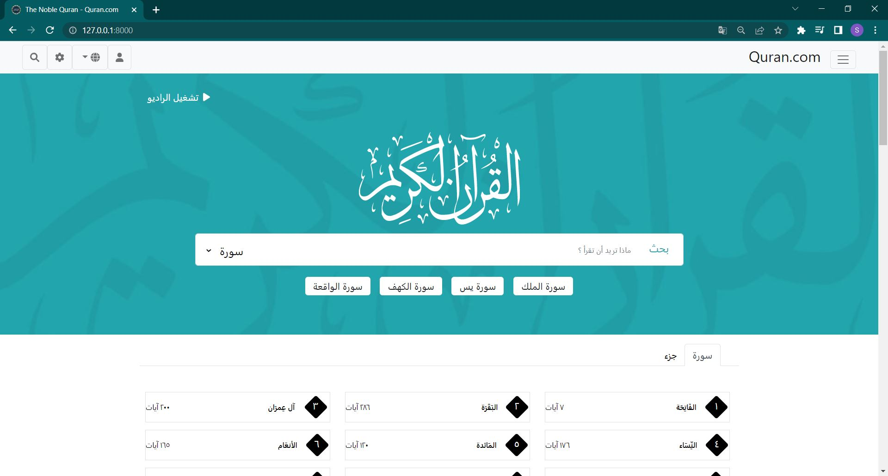
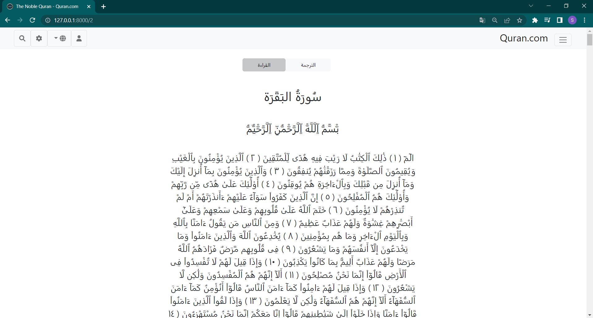

# Laravel_Quran
This is a Laravel web application that displays the complete Quran. The main goal was to make a website like [Quran.com](https://quran.com/en).
- The website displays all 30 juzs with all 114 surahs connecting them to their ayats.
- It supports two languages arabic and english.
- It supports live search with different options (Juz, Surah, and page).
- The database is designed in a way that makes it penifis from eager loading.

### English View

### Arabic View

---

## How to install and run on your local system

- Clone the repository with __git clone__
- Run __composer install__
- Copy __.env.example__ file to __.env__ and edit database credentials there
- Run __php artisan key:generate__
- import the database from the TO_USE folder
- Run __npm install__
- Run __npm run dev__
- Run __php artisan serve__ (if the server opens up, http://127.0.0.1:8000, then you are good to go)

---

### License

Please use and reuse however you want.

---

## Resources
- Some of the data I obtained from [SalamQuran](from https://github.com/salamquran) and edited.
- [Eager loading laravel](https://laravel.com/docs/9.x/eloquent-relationships)
